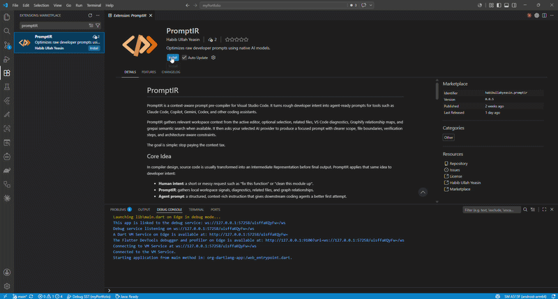

# PromptIR

PromptIR is a context-aware prompt pre-compiler for Visual Studio Code. It turns rough developer intent into agent-ready prompts for tools such as Claude Code, Copilot, Gemini, Codex, and other coding assistants.

PromptIR gathers relevant workspace context from the active editor, optional selection, related files, VS Code diagnostics, Graphify relationship maps, and grepai semantic search when available. It then asks your selected AI provider to produce a focused prompt with clearer scope, file boundaries, verification steps, and architecture-aware constraints.

The goal is simple: stop paying the context tax.

## Core Idea

In compiler design, source code is usually transformed into an Intermediate Representation before final output. PromptIR applies that same idea to developer intent:

- **Human intent**: a short or messy request such as "fix this function" or "clean this module up".
- **PromptIR**: gathers local workspace signals, diagnostics, related files, and graph relationships.
- **Agent prompt**: a structured, context-rich instruction that gives downstream coding agents a better first attempt.

PromptIR does not replace coding agents. It prepares better instructions for them.

## Features

Use **PromptIR: Open Chatbox** to work from the sidebar, or **PromptIR: Optimize Prompt with Context** to open the Composer.

PromptIR includes these intent presets:

- **Optimize Prompt**: rewrites a rough goal into a detailed prompt with clean folder structure expectations, explicit file boundaries, ASCII directory-tree guidance, and readability constraints.
- **Prepare Implementation Plan**: creates a planning-only prompt that locks the downstream agent into Structural Planning Mode before code edits.
- **Ask Follow-Up Questions**: generates 3-5 clarifying questions before creating a final prompt.
- **Analyze Current Problems**: uses VS Code diagnostics to prepare a focused debugging prompt.
- **Diagnose Build Failure**: combines pasted build, test, or terminal output with workspace context.
- **Explain This File**: requests architecture, responsibilities, dependencies, data flow, risks, and a reading order.
- **Refactor Safely**: prepares behavior-preserving refactor prompts with testing expectations.
- **Review For Bugs**: creates code-review prompts focused on correctness, edge cases, regressions, security, and missing tests.
- **Improve UI/UX**: gathers component, style, and theme context for frontend improvement prompts.
- **Summarize Workspace Context**: creates a compact project map for external agents.
- **Security/Performance Pass**: prepares risk-focused prompts for unsafe input handling, auth, async behavior, expensive paths, and missing tests.

## Sidebar Workflow

The PromptIR sidebar is designed for repeated prompt refinement without leaving the editor:

- Choose a preset.
- Add raw instructions or constraints.
- Generate a context-aware prompt from editor, file, diagnostics, Graphify, and grepai context.
- Preview the generated prompt with lightweight Markdown rendering.
- Edit the generated prompt before copying it.
- Use follow-up question mode to answer clarifying questions and generate a final prompt.

Most presets copy the generated prompt automatically. Follow-up question mode waits until you answer the questions and create the final prompt.

Click the 🧩 icon in the sidebar header to open the **Context Tools** panel. It explains what Graphify, grepai, and Ollama each add to your context, shows whether they're installed, and gives you a one-click **Install** action for each. PromptIR works fully without any of them; they only make the gathered context richer when present.

## Graphify Context

PromptIR integrates with Graphify to add relationship-aware repository context when possible.

When Graphify is available, PromptIR can:

- Build or refresh `graphify-out/graph.json`.
- Add upstream dependencies and downstream dependents to the prompt context, anchored on the active file, any file paths mentioned in your prompt, and the files grepai's semantic search surfaces as most relevant.
- Fall back to editor, file, and diagnostics context if Graphify is missing or unavailable.

Graphify context is best-effort. PromptIR continues to work without it.

If your team shares a Graphify index in git, run **PromptIR: Install Team Graph Hooks** from the Command Palette. It installs Graphify's post-commit hook and merge driver so the shared graph stays in sync across commits, and offers to disable `promptir.graphify.autoReindex` to avoid double rebuilds.

## Semantic Search (grepai)

PromptIR can use [grepai](https://github.com/yoanbernabeu/grepai), a local, privacy-first semantic code search CLI, to find relevant files by meaning rather than keyword matching. When grepai is enabled and ready, PromptIR's **Optimize Prompt**, **Security/Performance Pass**, and **Improve UI/UX** presets prefer grepai's line-ranged results over whole-file keyword matches, stretching your `promptir.maxContextChars` budget further.

grepai requires a local embedding provider — [Ollama](https://ollama.com) by default. If grepai or Ollama aren't installed, or the index hasn't been built yet, PromptIR silently falls back to its existing keyword-based file search. Nothing breaks and nothing errors if you skip this entirely.

To set it up:

1. Install grepai and Ollama — see the **Context Tools** panel in the PromptIR sidebar (🧩), which links to each project's official installation guide for your OS.
2. Run `grepai init` in your workspace root to build its index, and keep `ollama serve` running (or let the Ollama app run in the background).
3. PromptIR detects readiness automatically; no restart is needed.

The PromptIR status bar shows a `Semantic: Ready / No Index / Off` indicator reflecting grepai's current state.

## AI Providers

PromptIR can generate prompts using:

- **GitHub Copilot** through the native VS Code Language Model API.
- **OpenAI** with your own API key.

To use OpenAI, open the PromptIR sidebar (**PromptIR: Open Chatbox**), click the settings icon, set **AI Provider** to `OpenAI`, and enter your API key there. The key is stored using VS Code's Secret Storage, not in plain settings.

## Settings

PromptIR contributes these settings:

| Setting Key                     |   Type    |  Default  | Description                                                                                                                                                                                                                   |
| :------------------------------ | :-------: | :-------: | :---------------------------------------------------------------------------------------------------------------------------------------------------------------------------------------------------------------------------- |
| `promptir.aiProvider`           | `string`  | `Copilot` | Choose `Copilot` or `OpenAI`.                                                                                                                                                                                                 |
| `promptir.openaiApiKey`         | `string`  |   empty   | Legacy field, used only to migrate a previously-saved key into Secret Storage on first launch. Set your key from the PromptIR sidebar settings panel instead; values typed directly into this setting are not used.           |
| `promptir.openaiModel`          | `string`  | `gpt-4o`  | OpenAI model used for prompt generation.                                                                                                                                                                                      |
| `promptir.graphify.autoReindex` | `boolean` |  `true`   | Rebuild Graphify index files incrementally on text document saves.                                                                                                                                                            |
| `promptir.graphify.maxDepth`    | `number`  |    `5`    | Maximum number of connected Graphify nodes to include in context.                                                                                                                                                             |
| `promptir.grepai.enabled`       | `boolean` |  `true`   | Use grepai for semantic code search when gathering context for prompt-aware presets. Falls back to keyword-based search automatically when grepai is unavailable.                                                            |
| `promptir.grepai.maxResults`    | `number`  |    `5`    | Maximum number of semantic search hits to request from grepai per prompt (1-10).                                                                                                                                              |
| `promptir.maxContextChars`      | `number`  |  `24000`  | Maximum total characters of gathered context (active file, Graphify map, related files, diagnostics) sent to the AI provider per request. Lower this if your provider rejects requests for exceeding its message/token limit. |

## Privacy

PromptIR gathers workspace context locally inside VS Code before sending the selected prompt payload to your configured AI provider. If you use Copilot, generation goes through VS Code's language model API. If you use OpenAI, generation uses your configured OpenAI API key, which PromptIR stores using VS Code's Secret Storage rather than plain settings.

## Requirements

- Visual Studio Code `^1.120.0`
- GitHub Copilot access, or an OpenAI API key
- Optional: Graphify for relationship-aware repository context
- Optional: [grepai](https://github.com/yoanbernabeu/grepai) and [Ollama](https://ollama.com) for semantic code search

## License

PromptIR is open source under the MIT License.

Brought to you by [ToolsDigger](https://toolsdigger.com/promptir).
